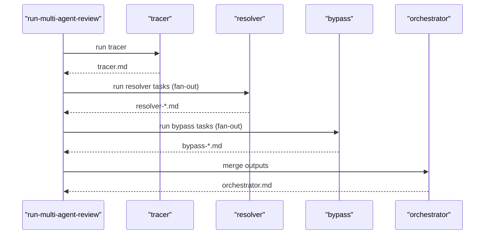

# Multi-Agent Security Review — Operational Notes

This file documents implementation details and gotchas for running the multi-agent security review workflow. It is intentionally **not** loaded as a skill so that operational notes do not leak into prompts.

## Runner Script Map (run-multi-agent-review.sh)
The shell runner drives the tracer → resolver → bypass → orchestrator pipeline from cold. It is designed to be readable and safe to modify if you understand the moving parts.

### High‑level flow
1. Parse CLI args (`--focus`, `--target`, `--context`, `--parallel`).
2. Run **tracer** → write `tracer.md`.
3. Parse tracer’s **Resolver Task List** → spawn one resolver per task.
4. Parse each resolver’s **Bypass Task List** → spawn one bypass per task.
5. Merge all outputs into `orchestrator.md`.
6. If any bypass fails, retry once using *resolver output only* as context.

### Sequence diagram

### Key functions
- `log()` — stderr logger used throughout.
- `sanitize_id()` — normalizes task IDs for filenames.
- `extract_tasks(section, file)` — parses task list sections and extracts:
  - task id
  - task description
  - `files:` list (optional)
  - **Skips** entries that say “None”.
- `task_files_to_context(files)` — converts `files:` entries into `@path` context args, stripping line ranges and ignoring missing files.
- `wait_for_slot()` / `wait_for_pids()` — parallelism control for resolver/bypass phases.

### Output structure
Outputs are written to `security-review/<run-id>/`:
- `tracer.md`
- `resolver-<task-id>.md`
- `bypass-<resolver-id>--<task-id>.md`
- `orchestrator.md`
- `bypass-failures.txt` (only when needed)

### Gotchas (runner behavior)
- **Task list parsing is strict.** `files:` is the only source of per‑task context files; anything outside `files:` is treated as description text. If you omit `files:`, the bypass will still run, but without extra file context.
- **“None” bypass entries are ignored.** If a resolver outputs `- None: ...` or `- None.` that task is skipped.
- **Retries are resolver‑only.** If a bypass fails, the retry uses *only* the resolver output (no tracer/context files). This is intentional to avoid path parsing failures.
- **Parallelism is soft.** The runner uses job counting; very high `--parallel` can still starve the main session or hit provider rate limits.

## Persona + Topic Injection
If you are **not** using the stateful-memory extension, you can ignore this section.

Pi loads the **stateful-memory** extension globally (if installed at `~/.pi/agent/extensions/stateful-memory`). When active:
- `SOUL.md`, `STYLE.md`, and `REGISTER.md` are injected into the system prompt on every turn.
- Topic addenda (e.g., `ethical_hacking.md`) are injected dynamically based on the prompt triggers.

**Implication:**
- Do **not** pass persona or topic files manually (`@ethical_hacking.md`) when running tracer/resolver/bypass via `pi`. That would double-load the content.

If you need only the ethical hacking topic and no others, pass a minimal `PI_STATEFUL_MEMORY_TOPICS_FILE` (environment variable) for the subprocesses that contains only that topic.

## Runner Expectations
The repo-local runner `security-review/run-multi-agent-review.sh` spawns separate `pi` processes for each role:
- `tracer.md` is generated first.
- A **resolver per task** is spawned based on the tracer task list.
- A **bypass per task** is spawned based on each resolver task list.
- The orchestrator merges all outputs and emits a final report.

Outputs are written to `security-review/<run-id>/`:
- `tracer.md`
- `resolver-<task-id>.md`
- `bypass-<resolver-id>--<task-id>.md`
- `orchestrator.md`

This avoids collisions when multiple resolvers or bypasses run in parallel.

## Task List Format
Tracer must emit:
- `Resolver Task List`
  - `<task-id>: <gate to verify> (files: path:line-range)`

Resolver must emit:
- `Bypass Task List`
  - `<task-id>: <confirmed chain to exploit> (files: path:line-range)`

The runner sanitizes task IDs for filenames and prefixes bypass output with the resolver task id.

## Optional Isolation
If you need strict isolation (e.g., no global extensions), add `--no-extensions` to the runner’s `pi` invocations and pass explicit context files. This will disable stateful-memory injection.
